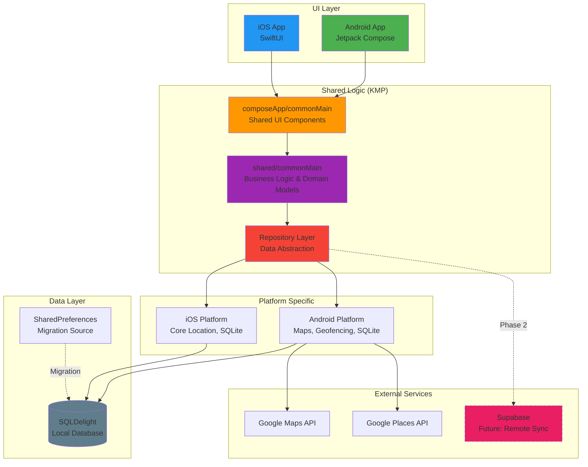
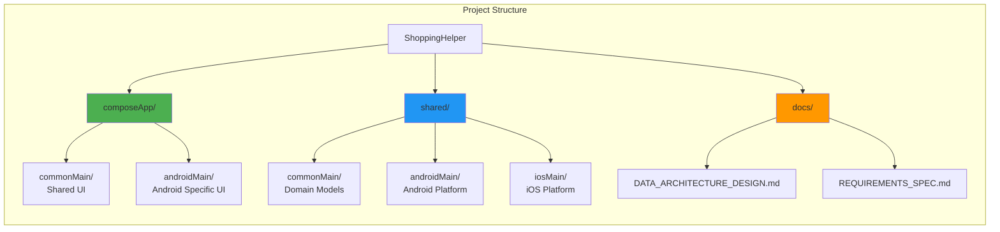
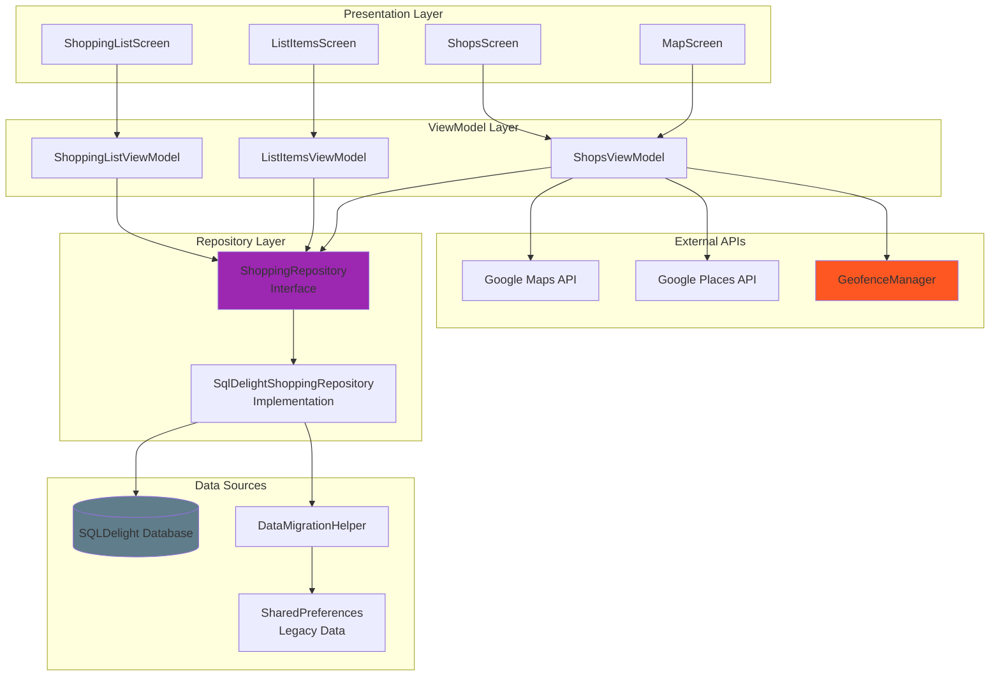
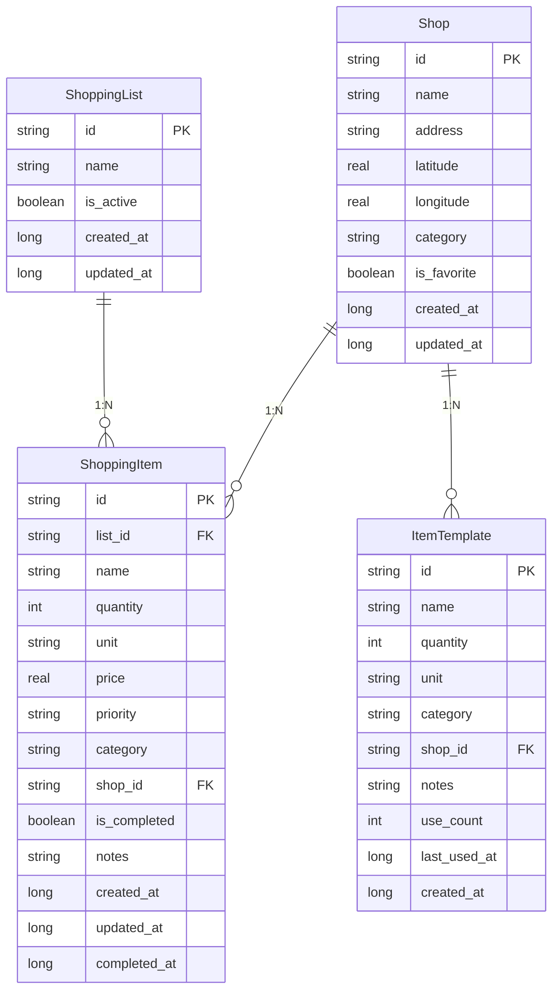

# ShoppingHelper

A **Kotlin Multiplatform (KMP)** shopping list application with intelligent location-based features. The app helps users manage shopping lists efficiently and provides geofencing notifications when near stores with pending items.

## 🚀 Key Features

- **Multi-platform Support**: Native iOS and Android apps with shared business logic
- **Location-aware Shopping**: Geofencing notifications when approaching stores with pending items
- **Offline-first Architecture**: Local SQLDelight database with planned cloud synchronization
- **Modern UI**: Jetpack Compose with Material 3 design system
- **Intelligent Organization**: Multiple shopping lists, item categorization, and shop associations

## 🏗️ Architecture Overview

### System Architecture



### Module Structure



### Data Flow Architecture



### Database Schema



## 🛠️ Technology Stack

| Layer | Technology | Purpose |
|-------|------------|---------|
| **UI Framework** | Jetpack Compose | Modern declarative UI for Android |
| **Platform** | Kotlin Multiplatform | Shared business logic across platforms |
| **Local Database** | SQLDelight | Type-safe SQL queries with KMP support |
| **Dependency Injection** | Koin | Lightweight DI framework |
| **Navigation** | Navigation Compose | Screen navigation and deep linking |
| **Maps** | Google Maps SDK | Location services and map display |
| **Geofencing** | Google Play Services | Location-based notifications |
| **Serialization** | Kotlinx Serialization | JSON parsing and data migration |

## 🚦 Getting Started

### Prerequisites

- **Android Studio** Hedgehog (2023.1.1) or later
- **Kotlin** 1.9.20+
- **JDK** 17+
- **Xcode** 15+ (for iOS development)
- **Google Maps API Key** (configured in `gradle.properties`)

### Quick Start

1. **Clone the repository**
   ```bash
   git clone https://github.com/your-username/ShoppingHelper.git
   cd ShoppingHelper
   ```

2. **Configure API Keys**
   ```bash
   # Copy the sample file and add your API keys
   cp local.properties.sample local.properties
   
   # Edit local.properties and replace with your actual keys
   MAPS_API_KEY=your_google_maps_api_key_here
   SUPABASE_URL=https://your-project.supabase.co
   SUPABASE_PUBLISHABLE_KEY=your_supabase_publishable_key_here
   ```
   
   **Google Maps API:**
   - Visit [Google Cloud Console](https://console.cloud.google.com/)
   - Create a project and enable "Maps SDK for Android" and "Places API"
   - Generate an API key and configure restrictions
   
   **Supabase (Phase 2):**
   - Visit [Supabase](https://supabase.com/) and create a project
   - Get URL and **Publishable key** from Project Settings → API (not legacy anon key)
   - See `docs/SUPABASE_SETUP_GUIDE.md` for detailed setup

3. **Build and run**
   ```bash
   # Android
   ./gradlew :composeApp:assembleDebug
   
   # iOS Framework
   ./gradlew linkDebugFrameworkIosArm64
   ```

### Development Commands

```bash
# Build project
./gradlew build

# Run tests
./gradlew test

# Generate SQLDelight interfaces
./gradlew generateSqlDelightInterface

# Debug with Database Inspector
./gradlew :composeApp:assembleDebug

# Lint and formatting
./gradlew lint
./gradlew lintFix
```

## 📱 Features in Detail

### Core Functionality

- **Multiple Shopping Lists**: Create and manage multiple shopping lists with active state
- **Smart Item Management**: Add items with quantities, units, prices, and priority levels
- **Shop Integration**: Associate items with specific shops for optimized shopping routes
- **Template System**: Save frequently purchased items as templates for quick addition

### Location Features

- **Interactive Maps**: Google Maps integration showing shops and current location
- **Geofencing**: Automatic notifications when approaching shops with pending items
- **Shop Discovery**: Find nearby stores using Google Places API
- **Route Optimization**: Plan efficient shopping routes across multiple stores

### Data Management

- **Offline-first**: All data stored locally with SQLDelight for reliable offline access
- **Automatic Migration**: Seamless upgrade from SharedPreferences to SQLDelight
- **Type Safety**: Compile-time SQL validation and type-safe database operations
- **Reactive Updates**: Real-time UI updates using Kotlin Flow

## 🗂️ Project Structure

```
ShoppingHelper/
├── composeApp/                 # Android application module
│   ├── src/commonMain/         # Shared Compose UI components
│   └── src/androidMain/        # Android-specific implementations
├── shared/                     # Shared business logic module
│   ├── src/commonMain/         # Platform-agnostic code
│   ├── src/androidMain/        # Android-specific implementations
│   └── src/iosMain/            # iOS-specific implementations
├── docs/                       # Project documentation
│   ├── DATA_ARCHITECTURE_DESIGN.md
│   └── REQUIREMENTS_SPEC.md
├── CLAUDE.md                   # Development guidance
└── README.md                   # This file
```

## 🔄 Development Phases

The project follows a three-phase development approach:

### Phase 1: Local Foundation ✅ **Completed**
- SQLDelight local database implementation
- Core CRUD operations for shopping lists, items, and shops
- Automatic data migration from SharedPreferences
- Repository pattern with reactive Flow-based APIs

### Phase 2: Cloud Integration 📋 **Planned**
- Supabase backend integration
- User authentication (email/Google)
- Real-time data synchronization
- Offline-first with cloud backup

### Phase 3: Advanced Features 🚀 **Future**
- GraphQL API with Apollo Kotlin
- Advanced search and filtering
- Machine learning recommendations
- Social features and list sharing

## 🧪 Testing

The project includes comprehensive testing at multiple layers:

```bash
# Unit tests
./gradlew testDebugUnitTest

# iOS tests  
./gradlew iosX64Test

# Integration tests
./gradlew connectedAndroidTest

# All checks (lint + tests)
./gradlew check
```

## 📊 Debugging

### Database Inspector

Use Android Studio's Database Inspector to examine the SQLDelight database:

1. Build debug APK: `./gradlew :composeApp:assembleDebug`
2. Run the app on device/emulator
3. Open **Tools → Database Inspector**
4. Select `shopping.db` to view tables and data

### Geofence Testing

Use the built-in `GeofenceDemo` components to test location features:

```kotlin
// Test geofence notifications
val geofenceManager = GeofenceManager(context)
geofenceManager.setupGeofencesForShops(testShops)

// Verify notification system
val notificationManager = ShoppingNotificationManager(context)
notificationManager.showTestNotification()
```

## 🔧 Troubleshooting

### Google Maps Authorization Error

If you see "Authorization failure" when using maps, follow these steps:

#### 1. Check API Enablement
Ensure these APIs are enabled in [Google Cloud Console](https://console.cloud.google.com/):
- **Maps SDK for Android**
- **Places API** (for future features)

#### 2. Configure API Key Restrictions
1. Go to **APIs & Services → Credentials** in Google Cloud Console
2. Click on your API key
3. Under **Application restrictions**, select **Android apps**
4. Add your app details:
   - **Package name**: `xyz.moroku0519.shoppinghelper.debug` (for debug builds)
   - **SHA-1 certificate fingerprint**: Get with this command:
   
   ```bash
   # Get debug SHA-1 fingerprint
   keytool -list -v -keystore ~/.android/debug.keystore -alias androiddebugkey -storepass android -keypass android
   ```
   
   Look for the SHA1 line, e.g.: `F4:DD:B6:7B:B0:E8:1B:0A:DD:9B:8A:68:05:E5:F9:5B:2F:A0:24:88`

#### 3. API Restrictions
Under **API restrictions**, select **Restrict key** and choose:
- Maps SDK for Android
- Places API

#### 4. Verify Setup
```bash
# Use the built-in diagnostics script
./debug_api_setup.sh

# Or manually check:
./gradlew clean
./gradlew :composeApp:assembleDebug
cat composeApp/build/intermediates/merged_manifests/debug/processDebugManifest/AndroidManifest.xml | grep -A 2 "API_KEY"
```

#### 5. Common Issues
- **Wrong package name**: Ensure you use `xyz.moroku0519.shoppinghelper.debug` for debug builds
- **Missing SHA-1**: The debug keystore SHA-1 must be registered
- **API not enabled**: Both Maps SDK for Android and Places API must be enabled
- **Quota exceeded**: Check API usage limits in Google Cloud Console

## 🔒 Security

### API Key Management

- **API keys are stored in `local.properties`** (git-ignored)
- **Never commit API keys** to version control
- **Use `local.properties.sample`** as a template for setup
- **API keys are loaded at build time** from local.properties → gradle.properties → default

### Setup for New Developers

```bash
# 1. Copy the sample configuration
cp local.properties.sample local.properties

# 2. Edit local.properties with your actual API keys
# MAPS_API_KEY=your_actual_api_key_here

# 3. Verify the setup works
./gradlew :composeApp:assembleDebug
```

## 🤝 Contributing

1. Fork the repository
2. Create a feature branch (`git checkout -b feature/amazing-feature`)
3. Follow the existing code style and architecture patterns
4. Add tests for new functionality
5. **Never commit sensitive data** (API keys, credentials)
6. Commit your changes (`git commit -m 'Add amazing feature'`)
7. Push to the branch (`git push origin feature/amazing-feature`)
8. Open a Pull Request

## 📄 License

This project is licensed under the MIT License - see the [LICENSE](LICENSE) file for details.

## 🙏 Acknowledgments

- **Kotlin Multiplatform** team for excellent cross-platform capabilities
- **SQLDelight** for type-safe database operations
- **Jetpack Compose** for modern Android UI development
- **Google Maps Platform** for location services and mapping

---

For detailed technical documentation, see the [docs/](docs/) directory.