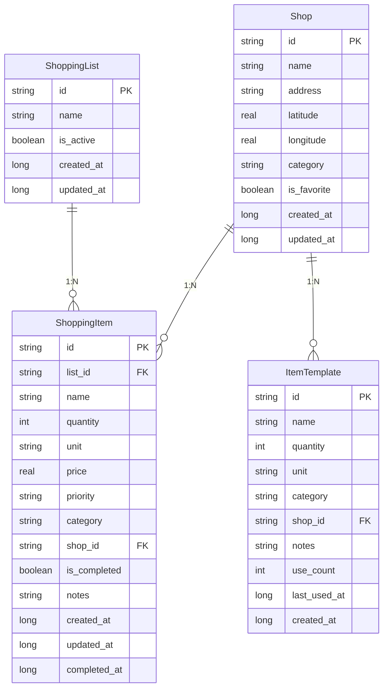

# データアーキテクチャ設計書 (Data Architecture Design Document)

## 概要

ShoppingHelperアプリのデータ層アーキテクチャ設計と実装の詳細を記載します。Phase 1（ローカルDB）からPhase 3（GraphQL統合）までの段階的な進化を想定した設計となっています。

---

## 目次

- [1. アーキテクチャ概要](#1-アーキテクチャ概要)
- [2. データモデル設計](#2-データモデル設計)
- [3. Phase 1: SQLDelightローカルDB](#3-phase-1-sqldelightローカルdb)
- [4. Phase 2: Supabaseリモート統合（計画）](#4-phase-2-supabaseリモート統合計画)
- [5. Phase 3: GraphQL統合（計画）](#5-phase-3-graphql統合計画)
- [6. 技術的決定事項](#6-技術的決定事項)
- [7. パフォーマンス考慮事項](#7-パフォーマンス考慮事項)
- [8. デバッグ・運用](#8-デバッグ運用)

---

## 1. アーキテクチャ概要

### 1.1 設計原則

- **オフラインファースト**: ローカルDBを真実の源として、リモート同期は補完的
- **リアクティブ**: Kotlin FlowによるUI自動更新
- **型安全**: SQLDelightによるコンパイル時SQL検証
- **マルチプラットフォーム**: KMPでiOS/Android共通ロジック
- **段階的進化**: Phase毎に機能拡張、既存機能への影響最小化

### 1.2 技術スタック

| レイヤー | 技術 | 責務 |
|---------|------|------|
| **UI Layer** | Jetpack Compose | 宣言的UI、状態管理 |
| **ViewModel** | Kotlin Multiplatform | ビジネスロジック、状態保持 |
| **Repository** | Repository Pattern | データソース抽象化、キャッシュ戦略 |
| **Local DB** | SQLDelight | 型安全SQLクエリ、マルチプラットフォーム |
| **Remote API** | Supabase (計画) | リアルタイム同期、認証 |
| **DI** | Koin | 依存性注入、モックテスト対応 |

---

## 2. データモデル設計

### 2.1 ドメインモデル

```kotlin
// 買い物リスト
data class ShoppingList(
    val id: String,
    val name: String,
    val isActive: Boolean,
    val createdAt: Long,
    val updatedAt: Long
)

// 買い物アイテム
data class ShoppingItem(
    val id: String,
    val listId: String,        // FK to ShoppingList
    val name: String,
    val quantity: Int,
    val unit: String?,
    val price: Double?,
    val priority: Priority,     // HIGH, NORMAL, LOW
    val category: ItemCategory, // FOOD, DAILY, ELECTRONICS, etc
    val shopId: String?,       // FK to Shop (optional)
    val isCompleted: Boolean,
    val notes: String?,
    val createdAt: Long,
    val updatedAt: Long,
    val completedAt: Long?
)

// 店舗情報
data class Shop(
    val id: String,
    val name: String,
    val address: String?,
    val location: Location?,   // 緯度経度
    val category: ShopCategory, // SUPERMARKET, PHARMACY, etc
    val isFavorite: Boolean?,
    val createdAt: Long,
    val updatedAt: Long
)

// アイテムテンプレート（よく買うもの）
data class ItemTemplate(
    val id: String,
    val name: String,
    val quantity: Int,
    val unit: String?,
    val category: ItemCategory,
    val shopId: String?,       // 推奨店舗
    val notes: String?,
    val useCount: Int,         // 使用回数
    val lastUsedAt: Long?,
    val createdAt: Long
)
```

### 2.2 データベース関係図



---

## 3. Phase 1: SQLDelightローカルDB

### 3.1 実装概要

**状態**: ✅ 完了済み (2025-08-17)

SQLDelightを使用したローカルデータベース実装。SharedPreferencesから完全移行し、型安全なSQL操作を実現。

### 3.2 アーキテクチャ詳細

```kotlin
// Repository Interface (共通)
interface ShoppingRepository {
    fun getAllLists(): Flow<List<ShoppingList>>
    fun getActiveList(): Flow<ShoppingList?>
    suspend fun createList(name: String): ShoppingList
    suspend fun updateList(list: ShoppingList)
    suspend fun deleteList(listId: String)
    
    fun getItemsByListId(listId: String): Flow<List<ShoppingItem>>
    suspend fun addItem(item: ShoppingItem)
    suspend fun toggleItemComplete(itemId: String)
    // ... その他のCRUD操作
}

// SQLDelight実装
class SqlDelightShoppingRepository(
    private val database: ShoppingDatabase
) : ShoppingRepository {
    
    override fun getAllLists(): Flow<List<ShoppingList>> {
        return database.shoppingListQueries.getAllLists()
            .asFlow()
            .mapToList(Dispatchers.Default)
            .map { dbLists -> dbLists.map { it.toDomainModel() } }
    }
    
    // Boolean変換ロジック (SQLite: 1L/0L ↔ Kotlin: true/false)
    private fun DbShoppingList.toDomainModel() = ShoppingList(
        id = id,
        name = name,
        isActive = is_active == 1L,  // 重要な変換処理
        createdAt = created_at,
        updatedAt = updated_at
    )
}
```

### 3.3 データベース設定

```kotlin
// build.gradle.kts (shared module)
sqldelight {
    databases {
        create("ShoppingDatabase") {
            packageName.set("xyz.moroku0519.shoppinghelper.database")
            srcDirs.setFrom("src/commonMain/sqldelight")
        }
    }
}

// DI設定 (Koin)
val androidModule = module {
    single { DatabaseDriverFactory(get()) }
    
    single { 
        val driver = get<DatabaseDriverFactory>().createDriver()
        ShoppingDatabase(
            driver = driver,
            // Enum型カスタムアダプター
            shopping_itemAdapter = Shopping_item.Adapter(
                priorityAdapter = priorityAdapter,
                categoryAdapter = itemCategoryAdapter
            ),
            shopAdapter = Shop.Adapter(categoryAdapter = shopCategoryAdapter),
            item_templateAdapter = Item_template.Adapter(categoryAdapter = itemCategoryAdapter)
        )
    }
    
    single<ShoppingRepository> { SqlDelightShoppingRepository(get()) }
}
```

### 3.4 マイグレーション機能

```kotlin
class DataMigrationHelper(private val context: Context) {
    suspend fun migrateFromSharedPreferences(database: ShoppingDatabase): Boolean {
        if (!needsMigration()) return false
        
        database.transaction {
            migrateLists(database)
            migrateShops(database) 
            migrateItems(database)
            migrateTemplates(database)
        }
        
        markMigrationComplete()
        return true
    }
    
    private fun migrateLists(database: ShoppingDatabase) {
        val listsJson = prefs.getString("lists", "[]") ?: "[]"
        val lists = json.decodeFromString<List<ShoppingList>>(listsJson)
        
        lists.forEach { list ->
            database.shoppingListQueries.insertList(
                id = list.id,
                name = list.name,
                is_active = if (list.isActive) 1L else 0L, // Boolean変換
                created_at = list.createdAt,
                updated_at = list.updatedAt
            )
        }
    }
}
```

### 3.5 パフォーマンス最適化

**インデックス設計**:
```sql
-- 頻繁なクエリパターンに基づく
CREATE INDEX IF NOT EXISTS idx_shopping_item_list_id ON shopping_item(list_id);
CREATE INDEX IF NOT EXISTS idx_shopping_item_shop_id ON shopping_item(shop_id);  
CREATE INDEX IF NOT EXISTS idx_shopping_item_completed ON shopping_item(is_completed);
CREATE INDEX IF NOT EXISTS idx_shop_favorite ON shop(is_favorite);
CREATE INDEX IF NOT EXISTS idx_item_template_category ON item_template(category);
```

**クエリ最適化**:
```sql
-- 効率的なソート・フィルタリング
getItemsByListId:
SELECT * FROM shopping_item
WHERE list_id = ?
ORDER BY is_completed ASC, priority DESC, created_at ASC;

getIncompleteItemsByShop:  
SELECT * FROM shopping_item
WHERE shop_id = ? AND is_completed = 0
ORDER BY priority DESC, created_at ASC;
```

---

## 4. Phase 2: Supabaseリモート統合（計画）

### 4.1 設計概要

**状態**: 📋 計画中

オフラインファースト戦略でSupabaseとの双方向同期を実装。

### 4.2 アーキテクチャ設計

```kotlin
// ハイブリッドRepository
class HybridShoppingRepository(
    private val localDb: SqlDelightShoppingRepository,
    private val remoteApi: SupabaseDataSource,
    private val syncManager: DataSyncManager
) : ShoppingRepository {
    
    // 1. 読み込み: ローカル優先 + バックグラウンド同期
    override fun getAllLists(): Flow<List<ShoppingList>> {
        return localDb.getAllLists()
            .onStart { 
                // バックグラウンドで同期開始
                syncManager.syncLists() 
            }
    }
    
    // 2. 書き込み: ローカル即時 + リモート遅延
    override suspend fun createList(name: String): ShoppingList {
        val newList = localDb.createList(name)
        
        // バックグラウンドでリモート同期
        syncManager.queueForSync(newList, SyncOperation.CREATE)
        
        return newList
    }
}

// 同期マネージャー
class DataSyncManager(
    private val localDb: ShoppingDatabase,
    private val supabase: SupabaseClient
) {
    suspend fun syncLists() {
        try {
            val remoteData = supabase.from("shopping_lists").select()
            val localData = localDb.getAllLists()
            
            // 差分同期ロジック
            resolveConflicts(localData, remoteData)
        } catch (e: Exception) {
            // オフライン継続、後でリトライ
        }
    }
    
    private suspend fun resolveConflicts(local: List<ShoppingList>, remote: List<ShoppingList>) {
        // Last-Write-Wins戦略
        // updated_at を基準に新しい方を採用
    }
}
```

### 4.3 Supabaseスキーマ設計

```sql
-- PostgreSQLスキーマ (Supabase)
CREATE TABLE profiles (
    id UUID PRIMARY KEY REFERENCES auth.users,
    email TEXT,
    display_name TEXT,
    created_at TIMESTAMP DEFAULT NOW()
);

CREATE TABLE shopping_lists (
    id UUID PRIMARY KEY DEFAULT gen_random_uuid(),
    name TEXT NOT NULL,
    owner_id UUID REFERENCES profiles(id),
    is_shared BOOLEAN DEFAULT false,
    created_at TIMESTAMP DEFAULT NOW(),
    updated_at TIMESTAMP DEFAULT NOW()
);

-- Row Level Security
ALTER TABLE shopping_lists ENABLE ROW LEVEL SECURITY;

CREATE POLICY "Users can only see their own lists" ON shopping_lists
    FOR ALL USING (auth.uid() = owner_id);
```

### 4.4 認証フロー

```kotlin
// Supabase認証統合
class AuthenticationManager(private val supabase: SupabaseClient) {
    suspend fun signInWithEmail(email: String, password: String): Result<User> {
        return supabase.auth.signInWith(Email) {
            this.email = email
            this.password = password
        }
    }
    
    suspend fun signInWithGoogle(): Result<User> {
        return supabase.auth.signInWith(Google)
    }
    
    fun getCurrentUser(): Flow<User?> {
        return supabase.auth.currentUserOrNull().asFlow()
    }
}
```

---

## 5. Phase 3: GraphQL統合（計画）

### 5.1 設計概要  

**状態**: 📋 計画中

Apollo KotlinでSupabaseのGraphQLエンドポイントを活用し、柔軟なデータ取得を実現。

### 5.2 GraphQLスキーマ例

```graphql
type Query {
    myLists: [ShoppingList!]!
    currentList: ShoppingList
    shopsWithPendingItems: [Shop!]!
    searchItems(query: String!): [ShoppingItem!]!
}

type Mutation {
    createItem(input: CreateItemInput!): ShoppingItem!
    toggleItemComplete(id: ID!): ShoppingItem!
    shareList(listId: ID!, email: String!): ShareResult!
}

type Subscription {
    listUpdates(listId: ID!): ListUpdate!
    sharedListChanges: SharedListChange!
}

type ShoppingItem {
    id: ID!
    name: String!
    shop: Shop
    list: ShoppingList!
    priority: Priority!
    isCompleted: Boolean!
    completedBy: User
}
```

### 5.3 Apollo Kotlin実装

```kotlin
// GraphQL Repository
class GraphQLShoppingRepository(
    private val apollo: ApolloClient,
    private val localDb: SqlDelightShoppingRepository
) : ShoppingRepository {
    
    override fun getItemsByListId(listId: String): Flow<List<ShoppingItem>> {
        return apollo.query(GetItemsQuery(listId))
            .watchAsFlow() 
            .map { response -> response.data?.list?.items ?: emptyList() }
            .onStart {
                // ローカルキャッシュから即座に表示
                emit(localDb.getItemsByListId(listId).first())
            }
    }
    
    // Optimistic Updates
    override suspend fun toggleItemComplete(itemId: String) {
        apollo.mutation(ToggleItemMutation(itemId))
            .optimisticUpdates { cache ->
                // UI即座更新、後でサーバー結果で上書き
                cache.updateItem(itemId, completed = true)
            }
            .execute()
    }
}

// リアルタイム更新
class RealtimeSubscriptionManager(private val apollo: ApolloClient) {
    fun subscribeToListUpdates(listId: String): Flow<ListUpdate> {
        return apollo.subscription(ListUpdatesSubscription(listId))
            .toFlow()
            .map { it.data?.listUpdates }
            .filterNotNull()
    }
}
```

---

## 6. 技術的決定事項

### 6.1 重要な設計判断

| 判断事項 | 選択肢 | 決定 | 理由 |
|---------|--------|------|------|
| **ローカルDB** | Room vs SQLDelight | SQLDelight | KMP対応、型安全SQL、小さな学習コスト |
| **Boolean型** | AS Boolean vs Integer | Integer + 手動変換 | SQLite互換性、エラー回避 |
| **リモートDB** | Firebase vs Supabase | Supabase | PostgreSQL、GraphQL、オープンソース |
| **同期戦略** | Server-first vs Offline-first | Offline-first | UX、ネットワーク非依存 |
| **競合解決** | CRDT vs Last-Write-Wins | Last-Write-Wins | シンプル、十分な精度 |

### 6.2 型変換ロジック

**Boolean変換** (重要):
```kotlin
// SQLiteではBooleanが直接サポートされないため手動変換
// Write時
is_active = if (list.isActive) 1L else 0L

// Read時  
isActive = dbList.is_active == 1L
```

**Enum変換**:
```kotlin
// カスタムColumnAdapter
val priorityAdapter = object : ColumnAdapter<Priority, String> {
    override fun decode(databaseValue: String) = Priority.valueOf(databaseValue)
    override fun encode(value: Priority) = value.name
}
```

### 6.3 エラーハンドリング戦略

```kotlin
// Repository層でのエラーハンドリング
class SafeShoppingRepository(
    private val repository: ShoppingRepository
) : ShoppingRepository {
    
    override suspend fun addItem(item: ShoppingItem) {
        try {
            repository.addItem(item)
        } catch (e: SQLiteException) {
            // ローカルエラー → 詳細ログ + リトライロジック
            logger.error("Failed to add item locally", e)
            throw DataPersistenceException("アイテムの保存に失敗しました", e)
        } catch (e: NetworkException) {
            // リモートエラー → ローカル保存継続
            logger.warn("Remote sync failed, continuing offline", e)
            // バックグラウンドでリトライキューに追加
        }
    }
}
```

---

## 7. パフォーマンス考慮事項

### 7.1 ローカルDB最適化

**クエリ最適化**:
- 適切なインデックス設計（複合インデックス含む）
- LIMIT句の積極的活用
- N+1問題回避（JOINクエリ使用）

**メモリ効率**:
- Flow + Paging による大量データ対応
- 不要なデータの遅延読み込み
- 画像・バイナリデータの外部ストレージ化

### 7.2 同期パフォーマンス

**効率的同期**:
```kotlin
// 差分同期（タイムスタンプベース）
suspend fun incrementalSync(lastSyncTime: Long) {
    val changes = supabase
        .from("shopping_items")
        .select()
        .gt("updated_at", lastSyncTime)
        .execute()
    
    // ローカルに差分適用
    applyChangesToLocal(changes)
}

// バッチ同期（チャンク処理）
suspend fun batchSync(items: List<ShoppingItem>) {
    items.chunked(50).forEach { chunk ->
        supabase.from("shopping_items").upsert(chunk)
        delay(100) // レート制限考慮
    }
}
```

### 7.3 キャッシュ戦略

**Apollo GraphQL Cache**:
```kotlin
val apolloClient = ApolloClient.Builder()
    .normalizedCache(
        SqlNormalizedCacheFactory("apollo_cache.db")
    )
    .build()

// キャッシュポリシー
apollo.query(GetItemsQuery())
    .cachePolicy(CachePolicy.CacheFirst) // ローカル優先
    .execute()
```

---

## 8. デバッグ・運用

### 8.1 開発時デバッグ

**Database Inspector (Android Studio)**:
```kotlin
// デバッグビルドでの設定
android {
    buildTypes {
        debug {
            isDebuggable = true
            buildConfigField("boolean", "DEBUG", "true")
        }
    }
    buildFeatures {
        buildConfig = true
    }
}

// MainActivityでのデバッグ初期化
if (BuildConfig.DEBUG) {
    val debugHelper = DatabaseDebugHelper(this, database)
    debugHelper.printDatabaseStats()
    debugHelper.exportDatabaseFile()
}
```

**詳細ログ出力**:
```kotlin
class DatabaseDebugHelper(
    private val context: Context,
    private val database: ShoppingDatabase
) {
    fun printDatabaseStats() {
        Log.d(TAG, "Shopping Lists: ${database.shoppingListQueries.getAllLists().executeAsList().size}")
        Log.d(TAG, "Shopping Items: ${database.shoppingItemQueries.getAllIncompleteItems().executeAsList().size}")
        Log.d(TAG, "Shops: ${database.shopQueries.getAllShops().executeAsList().size}")
    }
    
    fun validateDatabaseIntegrity() {
        // 孤立データチェック
        // 外部キー制約違反チェック
        // データ型整合性チェック
    }
}
```

### 8.2 本番環境監視

**メトリクス収集**:
```kotlin
// 同期成功率、エラー率、レスポンス時間
class SyncMetrics {
    fun recordSyncAttempt(operation: String, success: Boolean, duration: Long) {
        // Firebase Analytics / Crashlytics
        // カスタムメトリクス送信
    }
}

// パフォーマンス監視
class DatabasePerformanceMonitor {
    fun measureQueryTime(query: String, operation: () -> Unit) {
        val startTime = System.currentTimeMillis()
        operation()
        val duration = System.currentTimeMillis() - startTime
        
        if (duration > SLOW_QUERY_THRESHOLD) {
            Log.w(TAG, "Slow query detected: $query took ${duration}ms")
        }
    }
}
```

### 8.3 データ整合性保証

**トランザクション管理**:
```kotlin
// 複数テーブル更新の原子性保証
suspend fun moveItemToList(itemId: String, newListId: String) {
    database.transaction {
        val item = database.shoppingItemQueries.getItemById(itemId).executeAsOne()
        
        database.shoppingItemQueries.updateItem(
            /* ... updated item with newListId ... */
        )
        
        // 関連データの整合性維持
        updateListModificationTime(item.list_id)
        updateListModificationTime(newListId)
    }
}
```

---

## 9. 今後の拡張予定

### 9.1 短期的改善（Phase 2）
- [ ] Supabase認証統合
- [ ] リアルタイム同期
- [ ] 家族間リスト共有
- [ ] オフライン操作のキューイング

### 9.2 中長期的改善（Phase 3以降）
- [ ] GraphQL最適化クエリ
- [ ] 高度な検索・フィルタリング  
- [ ] 機械学習による推奨機能
- [ ] 画像・音声メモ対応
- [ ] 位置ベース通知最適化

---

## 10. 参考資料

### 10.1 技術ドキュメント
- [SQLDelight Documentation](https://cashapp.github.io/sqldelight/)
- [Supabase Kotlin Documentation](https://supabase.com/docs/reference/kotlin)
- [Apollo Kotlin Documentation](https://www.apollographql.com/docs/kotlin/)
- [Kotlin Multiplatform Mobile](https://kotlinlang.org/docs/multiplatform-mobile-getting-started.html)

### 10.2 内部ドキュメント
- `CLAUDE.md` - プロジェクト設定と実行コマンド
- `shared/src/commonMain/sqldelight/` - SQLスキーマ定義
- `shared/src/commonMain/kotlin/xyz/moroku0519/shoppinghelper/data/` - Repository実装

---

**更新履歴**:
- 2025-08-17: Phase 1 SQLDelight実装完了、ドキュメント初版作成
- TBD: Phase 2 Supabase統合完了時更新予定
- TBD: Phase 3 GraphQL統合完了時更新予定

---

*このドキュメントは実装の進捗に合わせて継続的に更新されます。*